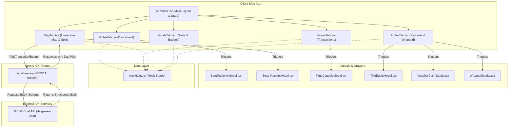
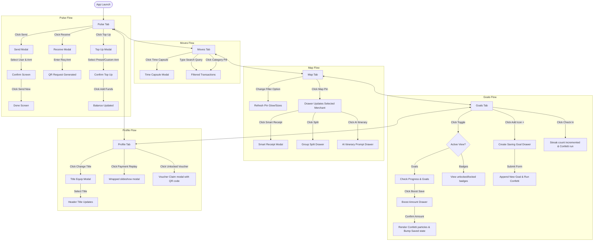
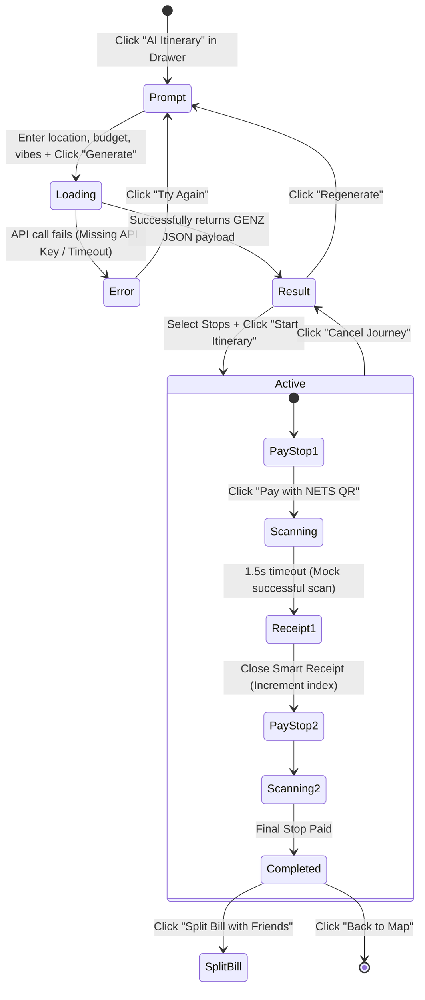
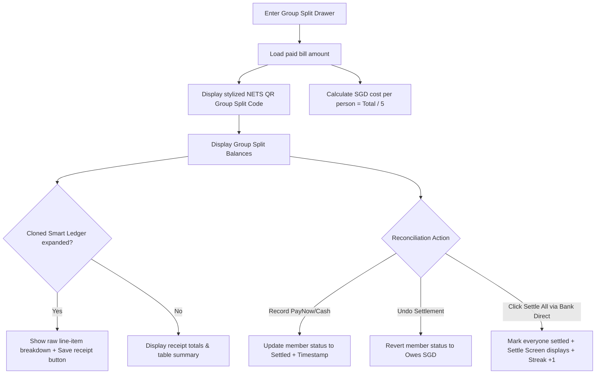

# NETS Pulse — Architecture & Map Flow

This document details the software architecture, system flow, component dependencies, and user interaction pathways for the **NETS Pulse** mobile web-app simulator.

---

## 1. System Architecture Overview

NETS Pulse is built as a single-page simulated mobile application inside a Next.js App Router workspace, styled with custom CSS gradients and responsive design principles. 



### Core Architecture Components

1. **App Shell Layer ([AppShell.tsx](file:///c:/Users/janni/OneDrive/Documents/GitHub/PolyFintech/nets-pulse/components/AppShell.tsx))**:
   - Manages active tab state (`activeTab`).
   - Renders the custom mobile chassis device frame with an interactive status bar (9:41 time, battery, wifi metrics) and bottom navigation bar.
2. **Sub-Tab Navigation Pages**:
   - [PulseTab.tsx](file:///c:/Users/janni/OneDrive/Documents/GitHub/PolyFintech/nets-pulse/components/tabs/PulseTab.tsx): Dashboard and quick-action launcher.
   - [MovesTab.tsx](file:///c:/Users/janni/OneDrive/Documents/GitHub/PolyFintech/nets-pulse/components/tabs/MovesTab.tsx): Spending charts (SVG Donut), categories, and scrollable transaction ledgers.
   - [MapTab.tsx](file:///c:/Users/janni/OneDrive/Documents/GitHub/PolyFintech/nets-pulse/components/tabs/MapTab.tsx): Core interactive map canvas, GENZ AI micro-itinerary state-machine, and the group split-ledger dashboard.
   - [GoalsTab.tsx](file:///c:/Users/janni/OneDrive/Documents/GitHub/PolyFintech/nets-pulse/components/tabs/GoalsTab.tsx): Gamification system checking streaks and boosting savings goals.
   - [ProfileTab.tsx](file:///c:/Users/janni/OneDrive/Documents/GitHub/PolyFintech/nets-pulse/components/tabs/ProfileTab.tsx): Equipped achievement titles, claims grid, and user stats.
3. **API Handler Routing ([route.ts](file:///c:/Users/janni/OneDrive/Documents/GitHub/PolyFintech/nets-pulse/app/api/itinerary/route.ts))**:
   - Handles the server-side proxy connection to the `deepseek-chat` model (branded as GENZ AI).
   - Validates environment variables (`DEEPSEEK_API_KEY`) and parses budget, preferences, and location to structure a strict system-level instructions context.
4. **Mock Database System ([mockData.ts](file:///c:/Users/janni/OneDrive/Documents/GitHub/PolyFintech/nets-pulse/lib/mockData.ts))**:
   - Holds centralized baseline definitions for items like user streaks, transaction logs, merchant coordinates, split groups, saving goals, and rewards.

---

## 2. Page & Navigation Flow (The App Map)

The following state flowchart demonstrates how a user moves between tabs, spawns modals, and updates their profile metadata (titles, balances, streaks) dynamically.



---

## 3. Map Tab Sub-Flows

The **Map Tab** is the most complex component of the application. It houses three distinct sub-flows that connect visual feedback to back-end endpoints.

### Sub-Flow A: AI Micro-Itinerary State Machine
The AI itinerary guides the user from prompt creation to a mock transaction sequence at overseas merchants.



### Sub-Flow B: Group Split & Ledger Reconciliation
This flow details how costs are split and reconciled within a travel group.



---

## 4. Key Data Models & Schemas

Here are the central JSON interfaces defined dynamically or read from `mockData.ts` to power client interactions.

### GENZ AI Itinerary API Response Schema
API Route: `/api/itinerary`
```typescript
interface AIResult {
  title: string;             // A catchy travel day title
  subtitle: string;          // Subheader describing the itinerary's vibe
  totalBudgetNote: string;   // Local price vs SGD estimate e.g. "≈ ฿1,680 ≈ SGD 60"
  currencySymbol: string;    // e.g. "฿", "¥", "RM"
  currencyCode: string;      // e.g. "THB", "JPY", "MYR"
  rateToSGD: number;         // e.g. 28 (exchange rate denominator)
  merchants: {
    id: number;
    icon: string;            // Emoji matching the category
    name: string;            // Name of the local merchant
    category: string;        // Shop type
    rating: number;          // 4.0 - 5.0 rating scale
    priceLocal: number;      // Itemized local price
    netsQr: boolean;         // Hardcoded true
  }[];
}
```

### Group Split Member Schema
```typescript
interface SplitGroupMember {
  id: number;
  name: string;
  avatar: string;
  color: string;             // Hex code for avatar badge styling
  owes: number;              // Owed SGD amount
  settled: boolean;          // Settlement checklist state
  method: string | null;     // Settle medium: PayNow, Cash, Bank Transfer, NETS QR
  settledAt: string | null;  // Timestamp
  note?: string;             // Remarks (e.g. "Paid at restaurant")
}
```

---

## 5. Architectural Recommendations

> [!TIP]
> **State Management Optimization**
> Currently, state updates (like adding a custom Goal, settling Split balances, or finishing an active AI Journey) live entirely in local component state. If the user shifts tabs, some modal-dependent flows might reset.
> To persist this data across tabs, consider migrating `USER`, `GOALS`, and `splitGroup` to a lightweight React Context Provider or state store (e.g., Zustand) mounted at the [AppShell.tsx](file:///c:/Users/janni/OneDrive/Documents/GitHub/PolyFintech/nets-pulse/components/AppShell.tsx) level.

> [!IMPORTANT]
> **API Key Safety**
> Ensure `DEEPSEEK_API_KEY` is kept secure. Never commit it to git. Maintain the current architecture where the key is only read within [route.ts](file:///c:/Users/janni/OneDrive/Documents/GitHub/PolyFintech/nets-pulse/app/api/itinerary/route.ts) on the server side, keeping the key invisible to client-side browsers.
